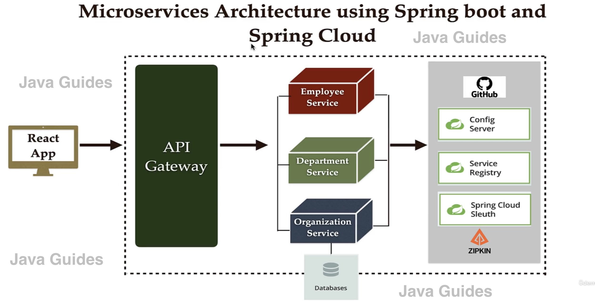

# Spring Boot Full Stack Application



This project is a demonstration of a full stack application using Spring Boot with a microservices architecture. It leverages cloud-native technologies and can be containerized for deployment in cloud environments like AWS or Azure. This README will guide you through setting up and running the application.

## Prerequisites

- Java 11
- Docker
- Maven

## Project Structure

- `MainApplication.java`: Main entry point for the Spring Boot application.
- `controller/HelloController.java`: A simple REST controller to demonstrate a basic API.
- `service/MessageService.java`: A sample service to demonstrate service layer logic.
- `docker-compose.yml`: Docker Compose file to set up multiple services like Kafka, Zookeeper, and the main application.
- `pom.xml`: Maven build file with project dependencies.

## Setup and Run

1. **Clone this repository:**
    ```bash
    git clone <repository-url>
    cd <repository-directory>
    ```

2. **Build the application:**
    ```bash
    ./mvnw clean install
    ```

3. **Run with Docker Compose:**
    ```bash
    docker-compose up --build
    ```

4. **Access the API:**
    Open your web browser and navigate to `http://localhost:8080/hello` to see the output from the HelloController.

## Additional Notes

- This application uses Kafka and Zookeeper for message-driven distributed system demonstration.
- The `docker-compose.yml` sets up a multi-container environment using Docker.
- Feel free to extend the application by adding more services, controllers, and endpoints as needed.

## Troubleshooting

If you face any issues during setup or while running the application, ensure that all prerequisites are met and that ports 8080, 9092, and 2181 are not being used by other applications.

---

This project is developed to demonstrate expertise in Java, Spring Boot, microservices architecture, and containerized deployments.
